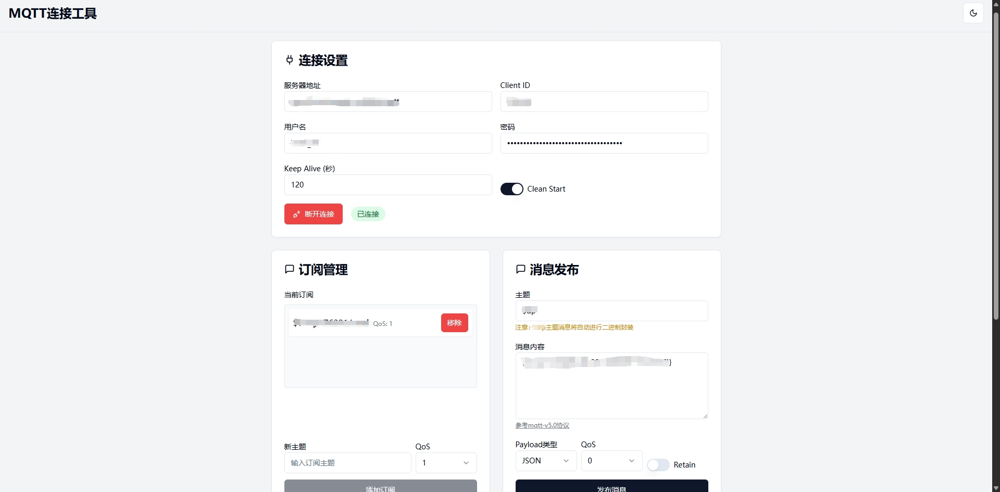
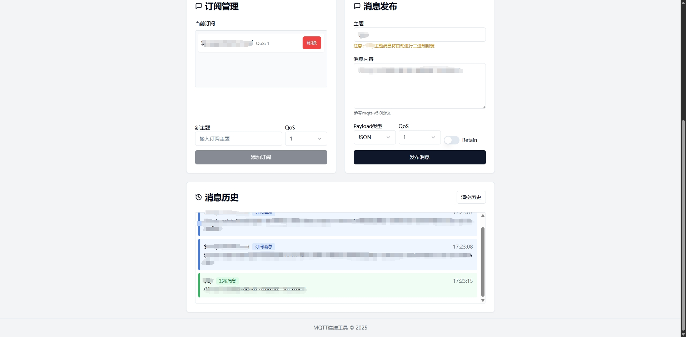

# mqtt-tool-web

[]()[]()[](https://opensource.org/licenses/MIT)
&nbsp;

一款基于 AI 生成的 mqtt 工具网站，用于模拟设备调试mqtt消息，可平替 mqttx ，mqtt.fx 等桌面端软件，支持本地部署，docker 部署，vercel serverless，欢迎体验.

## ✨ 特性

- 🎁 界面简洁明快，深色浅色模式一键切换
- 🦄 支持 MQTT-v5 协议连接(wss/ws)，支持 Keep Alive 与 Clean Start
- ☑️ 消息发布，支持 QoS 与 Retain 配置
- ✏  主题订阅，支持 QoS 配置与多主题订阅
- 🎯 发布消息内容支持 json/base64/text/Hex
- 🎈 订阅消息与发布消息历史记录
- ⛏  支持消息发布内容定制处理

## 🎉 应用界面
连接订阅/发布消息


历史消息


## ☑️ TODO

- [x] 支持 MQTT-v3 切换
- [x] 支持重连机制
- [x] 支持遗嘱消息
- [√] 支持 vercel serverless
- [x] 支持 cloudflare CDN 加速

## 🧑🏻‍🔧技术栈

- `JavaScript`
- `node`
- `nginx`
- `docker`

## 📢 项目说明

- 所有代码均基于 AI 生成，对话提示词可联系作者提供
- 设计支持跨平台部署，页面支持多端
- vercel 演示地址: https://mqtt-tool-bfs4hn5h0-h2pl4us-projects.vercel.app

## 🛠 快速开始

### 从源代码构建

```shell
# 请保证你的node版本不低于16
git clone https://github.com/H2pl4M/mqtt-tool-web.git
cd mqtt-tool-web
curl -o- https://raw.githubusercontent.com/nvm-sh/nvm/v0.39.1/install.sh | bash
nvm install 16
nvm use 16
npm run dev
```

### 基于 docker 容器

```shell
git clone https://github.com/H2pl4M/mqtt-tool-web.git
cd mqtt-tool-web
docker build -t mqtt-tool-web:1.0.1 .
docker run -p 3001:80 -d --name=dmqtttoolweb mqtt-tool-web:1.0.1
```

### 基于 vercel serverless

```
step0 fork https://github.com/H2pl4M/mqtt-tool-web.git
step1 打开 vercel dashboard
step2 AddNewProject 选择 github(需关联) 中的 mqtt-tool-web
step3 framework preset 默认 Vite
step4 Root Directory 默认 ./
step5 Build And Output Settings 将 Output Directory 修改为 build ,其他默认即可
step6 deploy...
```

## 🤝 交流反馈

- 提交 [📌Issues](https://github.com/H2pl4M/mqtt-tool-web/issues)

## 📜 开源许可

- 基于 [MIT license](https://opensource.org/licenses/MIT) 许可进行开源。